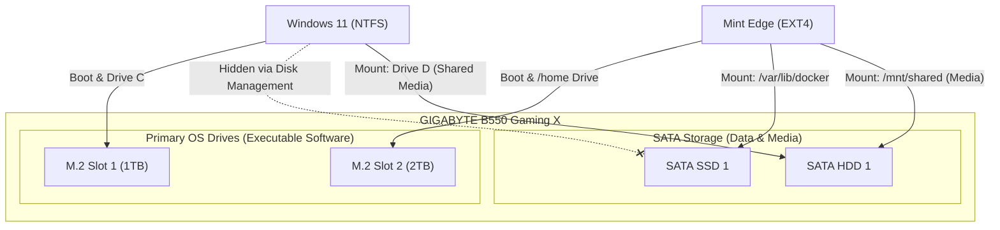

# B550 Workstation: Dual-Boot Implementation & Architecture Plan

## 1. Project Objective
To physically isolate Windows 11 and Linux (Mint Edge) across two dedicated M.2 NVMe drives, providing an uncompromised bare-metal environment for development, sandboxing, and Docker containerization on Linux, while preserving a pristine Windows 11 environment strictly for anti-cheat gaming and locked academic testing.

## 2. Storage & Filesystem Topology
*(Note: SATA drive assignments are pending physical inventory confirmation).*

## 3. Implementation Checklist

### Phase 1: Hardware Pre-Requisites
- [ ] Receive replacement Corsair 650W PSU from RMA process.
- [ ] Install PSU and verify stable ATX voltage via BIOS hardware monitor.
- [ ] Extract current Windows 11 Hardware UUID and Product Key to external USB.

### Phase 2: Windows 11 Isolation (M.2 #1)
- [ ] Build Windows 11 Installation USB via Media Creation Tool.
- [ ] Boot from USB and format the 1TB M.2 drive (Delete all existing partitions).
- [ ] Install Windows 11 directly to the unallocated 1TB drive.
- [ ] Verify Microsoft HWID Activation.
- [ ] Ensure the 2TB M.2 drive remains entirely untouched/unformatted by Windows.

### Phase 3: Linux Deployment (M.2 #2)
- [ ] Download Linux Mint (Edge Edition) ISO.
- [ ] Flash ISO to USB using Ventoy or BalenaEtcher.
- [ ] Boot from USB and execute Mint Installer.
- [ ] Target the 2TB M.2 drive for full installation (format as `EXT4` or `BTRFS`).
- [ ] Verify GRUB bootloader successfully detects both Windows 11 and Linux Mint during POST.

### Phase 4: Storage Allocation & Sandboxing Setup
- [ ] Inventory exact SATA drive counts and capacities.
- [ ] Format shared media drive(s) to `NTFS` or `exFAT`.
- [ ] Format isolated Linux Docker/VM drive(s) to `EXT4`.
- [ ] Configure Linux `/etc/fstab` to automatically mount the SATA drives on boot.
- [ ] (Optional) Apply `noexec` permission flag to the shared SATA drive in `/etc/fstab`.
- [ ] Configure Windows Disk Management to remove drive letters from Linux-exclusive SATA drives.
- [ ] Install Docker Engine on Linux host.
